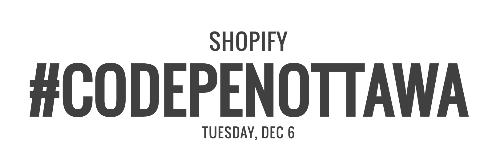

<section class="hero">
  
  <h1 class="hero__main-header">Welcome to CodePen <strong>Ottawa</strong></h1>
</section>
<section class="page__content">
  

    
A bunch of passionate individuals eager to bring fresh content to the Ottawa Front End community.

  

  

    <h2 class="page__content-section-header">Up and coming <strong>events</strong></h2>
    
    <button class="btn" type="button" name="Sign up">Sign Up</button>
  

</section>
